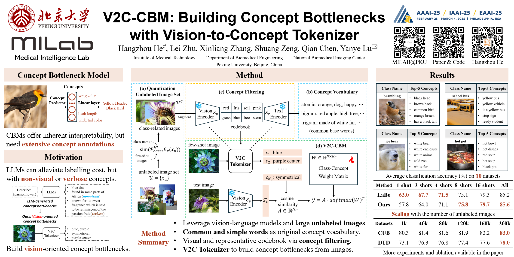

# V2C-CBM: Building Concept Bottlenecks with Vision-to-Concept Tokenizer (AAAI2025)

Paper with supplementary material: [arixv link](https://arxiv.org/abs/2501.04975)

`code_appendix` folder contains the code for concept filtering described in the paper.

For the training and inference code, please refer to the excellent work by [LaBo](https://github.com/YueYANG1996/LaBo), and we sincerely thank them for the inspiring articles and code.

checkpoint link: [google drive](https://drive.google.com/drive/folders/1gPwcoGf816OFxHgAS2N8LkUxCHLQZ9WF?usp=sharing)

